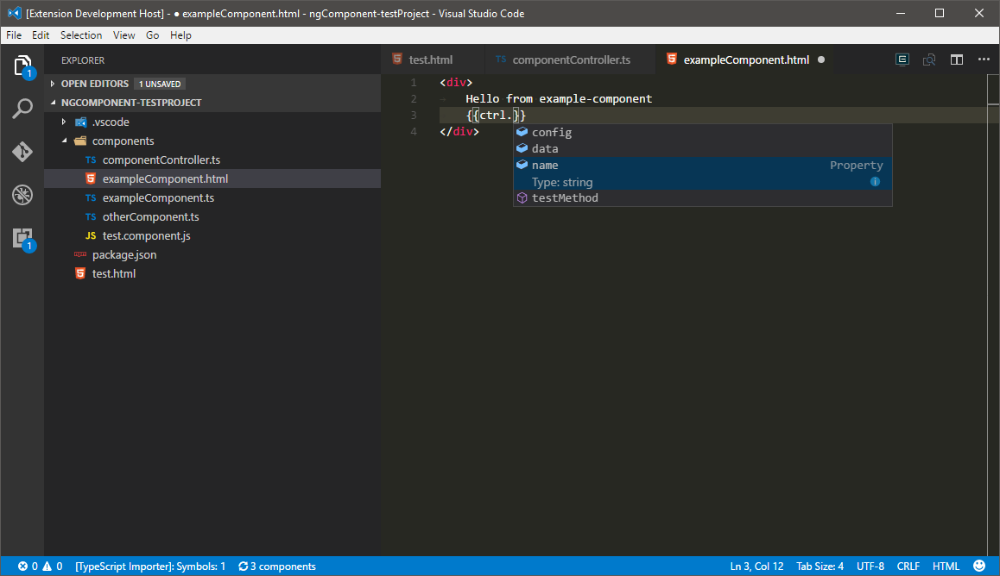
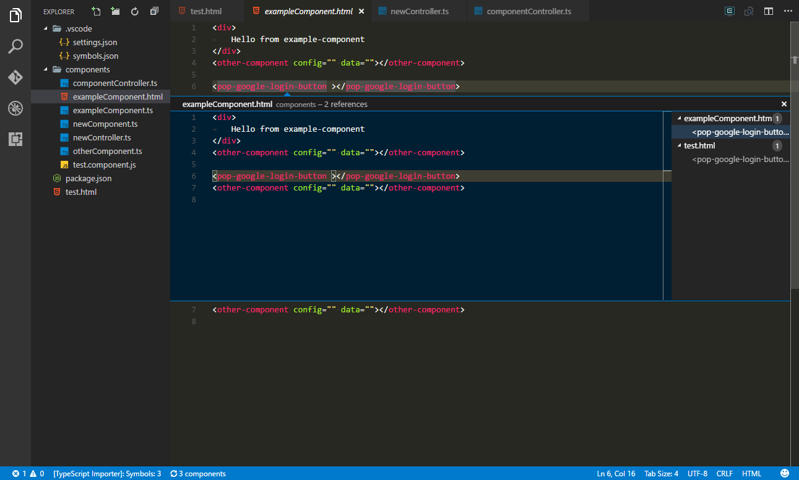
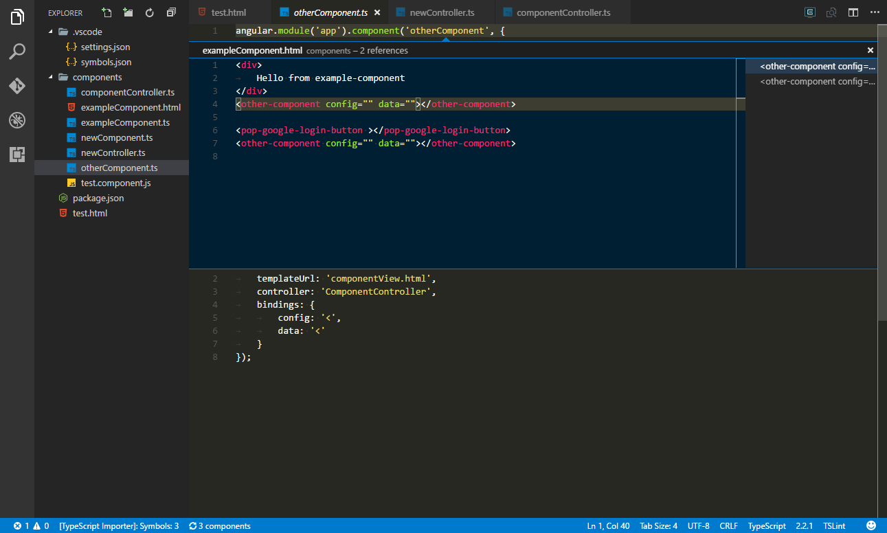
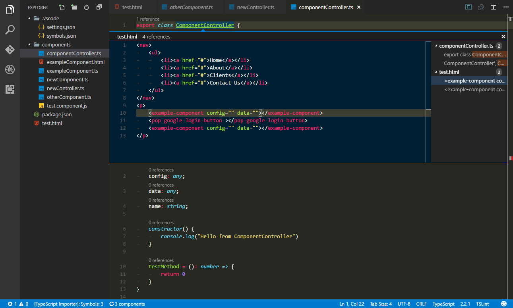
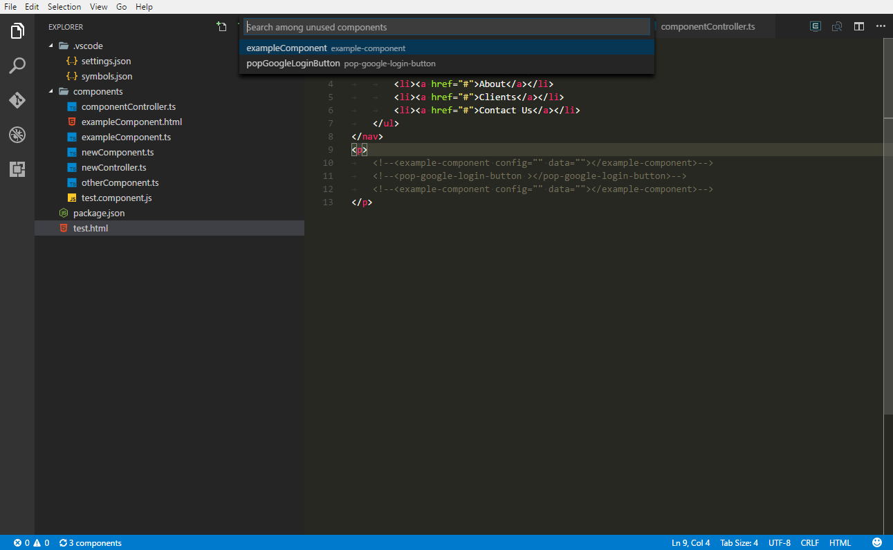

[](https://travis-ci.org/ipatalas/ngComponentUtility)
[](https://www.bithound.io/github/ipatalas/ngComponentUtility/master/dependencies/npm)
[](https://www.bithound.io/github/ipatalas/ngComponentUtility)

# Table of contents

- [Synopsis](#synopsis)
- [Breaking changes](#breaking-changes)
	- [Upgrading from 0.2.0](#upgrading-from-020)
- [Features](#features)
	- [Intellisense](#intellisense)
		- [Controller model in views (**introduced in 0.4.0**)](#controller-model-in-views)
	- [Go To Definition](#go-to-definition)
		- [Controllers](#controllers)
		- [Templates](#templates)
	- [Find All References (**introduced in 0.5.0**)](#find-all-references)
	- [Find unused components (**introduced in 0.5.0**)](#find-unused-components-experimental)
- [Configuration](#configuration)
- [Commands](#commands)
- [Performance note on configuration globs](#performance-note-on-configuration-globs)
- [Changelog](#changelog)
- [Roadmap](#roadmap)

# Synopsis

This extension is a result of hackathon event done in the company we work for. We had an opportunity to invest 2 days into anything we could possibly want.
We chose to develop an extension for VS Code which would make our daily work easier. Our current project is an Angular 1.5 based web application. As Angular developers we wanted to have auto-completion for all custom components that are available in our application.
Do not hesitate to [report](https://github.com/ipatalas/ngComponentUtility/issues) any issues you may find.

## Breaking changes

### Upgrading from 0.2.0

Please note that the configuration key has been changed from `ngIntelliSense.componentGlob` to `ngComponents.componentGlobs`. Sorry for inconvenience.

# Features

## Intellisense

Given the following components in a project:
```TypeScript
angular.module('app').component('exampleComponent', {
	/* other settings */
	bindings: {
		config: '<',
		data: '<'
	}
});

angular.module('app').component('otherComponent', {
	/* other settings */
	bindings: {
		config: '<',
		data: '<'
	}
});
```

One should be able to use auto-completion like that:


As a result component's html code along with all bindings is added.

It can also help with the bindings themselves (will only suggest missing ones):


There is now a command to refresh components cache which might be useful if you're developing components constantly and don't want to restart vscode each time.
You can trigger the command from command panel, it's called `Refresh components cache`. Alternatively you can just click the button on the status bar:


### Controller model in views

A new feature has been introduced to make working with views easier. You can now autocomplete controller member while being in component's view like seen on the screenshot below:



Currently only one level of intellisense is available since otherwise the extension would have to scan all files in the whole project. Controller files are already scanned so it was little effort to suggest its members.
There is a plan to extend this in the future to allow more complex behavior but it requires some research first to find an optimal way of scanning whole project (and perhaps caching the results to speed up consequent startups).
For now you can use this intellisense regardless of the cursor context. It works in every place in the file even though it makes no sense in some places.
It was just much easier to implement that way. Scanning for the context would require a lot of effort and the outcome wouldn't be so much visible. It's only a tool so take care of the context yourself. It might change in future.

> **New in 0.6.0:** `Go To Definition` also works for model members

## Go To definition

You can go from html directly to either the component definition, controller or template. Just use F12 (default) or `Go To Definition` command (either from context menu or commands panel) when cursor is focused on a component in html view.
Depending on the configuration in `ngComponents.goToDefinition` specific files will show up in Go To Definition window (see screenshot below).
If there is only one file configured, let's say the template, it will go straight to this file.

### Controllers

Controllers are searched using `ngComponents.controllerGlobs` setting. They are matched against the name used in component options `controller` field.
This can be either an identifier of the class used directly or string literal specifying the name of the controller registration in Angular which basically means one can name the Angular controller differently than the class itself and this feature will still work.

### Templates

Templates are searched based on either the `templateUrl` component option field or `template` field in the same component. They are mutually exclusive and both work here. Currently supported variations are:

- `templateUrl: 'components/exampleComponent.html'`
- `template: '<div>inline html template</div>'`
- `template: require('./components/exampleComponent.html')`

In case you have different scenarios please let me know the details and I'll try to include it in next version.


## Find All References

Finnaly it's here! A feature I've been waiting for long but never had time to implement :)

You can now use `Find All References` feature of vscode to navigate through usages of particular components. It works in all component parts: html template, controller and component itself. ~~Unfortunately currently it only works with usages found by `ngComponents.htmlGlobs` setting which should be the vast majority of components unless you use inline templates heavily which I stronly discourage to do :)~~
However there are places which do not require separate template files because they are too small, ie. angular-ui-router state definitions which possibly only contain oneliners with specific component. ~~Those usages won't be found... yet :) It's planned for next version.~~ (implemented in 0.5.1)

In HTML template cursor has to be focused on component name, not the binding or the inner html of the component for this to work:



In component definition file cursor has to be on component name:



In controller file cursor has to be on the class name:




## Find unused components (experimental)

This feature will allow you to easily find components which are not used in the project.
Currently it only finds references throughout all HTML files found by `ngComponents.htmlGlobs` setting. This is still not perfect as some components may be used inside inline templates in other components. Hopefully it will be improved in next version.
Selecting one of the unused components will navigate to it in the editor.

It does understand HTML a bit so commented out parts will be taken into account. See screenshot below:



# Configuration

This plugin contributes the following [settings](https://code.visualstudio.com/docs/customization/userandworkspace):

- `ngComponents.componentGlobs`: array of glob strings used to search for components. Default value is  **[\*\*/\*Component.ts]**
- `ngComponents.controllerGlobs`: array of glob strings used to search for controllers (used by `Go To Definition`). Default value is  **[\*\*/\*Component.ts]**
- `ngComponents.htmlGlobs`: array of glob strings used to search for html views (used by `Find All References`). Default value is  **[\*\*/\*Component.ts]**
- `ngComponents.routeGlobs`: array of glob strings used to search for angular-ui-router files (used by `Find All References`). Default value is  **[\*\*/\*route.ts]**
- `ngComponents.goToDefinition`: array of strings to define which files `Go To Definition` for a component should show. Allowed values are *template*, *controller*, *component*. Default value is **["template", "controller"]**
- `ngComponents.debugConsole`: boolean value to show debug information. Default value is **false**
- `ngComponents.controller.publicMembersOnly`: whether to suggest all members in view model auto complete. Default value is **true**
- `ngComponents.controller.excludedMembers`: a regular expression excluding member from view model auto completion. Default value is **^\\$** (for Angular lifecycle methods)
- `ngComponents.logging.verbose`: enable verbose logging (for troubleshooting)
- `ngComponents.logging.redirectToFile`: path to redirect logs to - needed when console is flooded with too many messages and supresses them

Whenever one of the globs changes components cache is automatically rebuilt. Additionally all component files are monitored for changes and they will be reflected immediately, ie. after adding a binding you can just save the file and go straight to template file to use that binding.

# Commands

This extension contributes the following commands to the Command palette.

- `Refresh Components Cache`: refreshes components cache on demand
- `Find unused Angular components`: searches for [unused components](#find-unused-components)

# Performance note on configuration globs

Please use as specific globs as possible. Parsing files is only a fraction of the whole process.
Vast majority of time is consumed on "globbing" for files to be processed so the more precise the globs are the better performance you can expect.

In my example project there are around 22k files and 3k folders. Given default glob pattern it takes slightly above a second to scan all these folders to find all component files.
Restricting the pattern to one single subfolder (ie. **subdir/\*\*/\*Component.ts**) which contains only 3k files and 500 folders it goes down to around 200-300ms on my machine being almost a second faster than the default.

The bigger the project the greater the impact so in general it is better to use multiple specific patterns rather than *one pattern to glob them all* :)

# Changelog

Full changelog is available [here](https://github.com/ipatalas/ngComponentUtility/blob/master/CHANGELOG.md) or in the Changelog tab from within vscode itself.

# Roadmap

The following features are planned:
- ~~ability to specify multiple globs in configuration~~
- ~~**Find all references** for components in html view~~
- ~~**Go to definition** for components in html view~~
	- ~~ability to pick which file to open if possible (view, component or controller)~~
	- ~~should work for both the component and it's attributes/bindings~~
- ~~auto refresh components when they change (reload only the one that has changed)~~
- ~~refresh all when configuration changes (glob for example)~~
- ~~basic intellisense for view model used in html files (at least first level)~~
- ~~Go To Definition for view model properties/methods (at least first level)~~
- ability to add binding from component usage in html (by typing it's name and selecting "Add binding" from intellisense menu or command)
- rename component feature - update all usages
- optimize parsing files, especially when component and controller globs have common files
	- careful to clear cache after entire scan, will need refactoring on file scanner first
- feature flags to disable specific functions
- ~~rethink the way components are parsed (component config is not a JSON, might contain incompatible stuff)~~
	- ~~`controller` field does not necessarily is a string, may be a class name directly~~
	- ~~`template` field may `require` a file instead of hardcoding it in the component~~
	- make sure both TypeScript and bare JS are supported (currently we focus on TS cause it's what we use)
- add support for Angular2 (perhaps as a separate extension)
